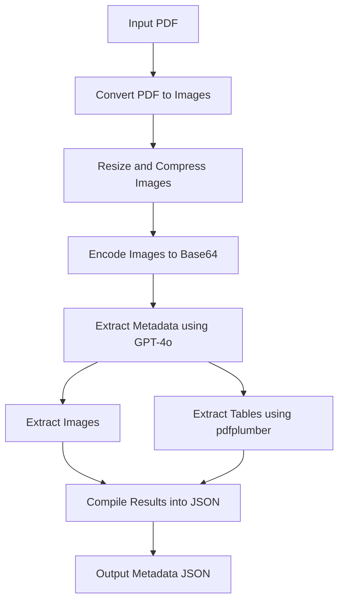

# GPT-4 Vision PDF Metadata Extraction Tutorial

This tutorial guides you through a pipeline that processes PDF documents, extracts metadata and other relevant information using GPT-4o, and outputs the results in a structured JSON format. The pipeline involves converting PDF pages to images, encoding these images, and sending them to the OpenAI API for processing.

### The Bigger Picture

We want to create a robust and automated solution to extract meaningful metadata from complex PDF documents. This pipeline is particularly useful for complex documents where extracting structured data manually would be time-consuming and prone to errors. Our focus is on understanding the images and tables contained in the PDFs and generating detailed metadata for them.

### Use Cases

This pipeline is designed to help teams who frequently deal with large volumes of documents. By automating the metadata extraction process, we can save time and improve the accuracy of data extraction. The structured JSON output can be easily integrated into databases, search engines, and other tools for further analysis and retrieval.


#### Concrete Examples

1. **Q&A Systems**:
   - **Example**: A legal firm handling large volumes of legal documents can use this pipeline to extract specific clauses, images (e.g., signatures), and tables (e.g., financial data) relevant to specific questions, enabling efficient and accurate retrieval of information.
   - **Benefit**: This allows for quick and precise answers to client queries by retrieving individual chunks and objects relevant to the questions.

2. **Academic Research**:
   - **Example**: Researchers can process scientific papers to extract metadata, images (e.g., experimental setups), and tables (e.g., results and statistics) for quick reference and comparison.
   - **Benefit**: Enhances literature reviews by organizing and indexing key information, making it easier to access and analyze relevant data.

3. **Healthcare**:
   - **Example**: Hospitals and clinics can extract patient information, medical images (e.g., X-rays), and tables (e.g., lab results) from medical reports.
   - **Benefit**: Facilitates quick retrieval of patient records and relevant data, improving the efficiency of patient care and reducing the risk of errors.

4. **Financial Services**:
   - **Example**: Financial analysts can extract financial statements, charts, and tables from annual reports to analyze company performance.
   - **Benefit**: Streamlines the process of financial analysis and reporting, allowing analysts to focus on insights rather than data extraction.

5. **Engineering and Manufacturing**:
   - **Example**: Engineers can extract diagrams, tables (e.g., material properties), and technical specifications from manuals and technical documents.
   - **Benefit**: Improves access to critical information required for design, testing, and manufacturing processes.

### Why This is Useful

1. **Efficiency**: Automates the process of extracting metadata, significantly reducing the time required compared to manual extraction.
2. **Accuracy**: Utilizes GPT-4o’s advanced natural language processing capabilities to accurately extract information from complex documents.
3. **Integration**: Provides structured JSON data that can be easily integrated into various systems for enhanced data management and retrieval.

## Libraries and Tools

- **pdf2image**: Converts PDF pages to images.
- **Pillow**: Handles image resizing and compression.
- **OpenAI**: Interacts with the GPT-4o API to extract metadata.
- **fitz (PyMuPDF)**: Reads and processes PDF documents.
- **pdfplumber**: Extracts tables from PDFs.
- **base64**: Encodes images to Base64 format for API usage.

## Pipeline Overview

In this pipeline, we aim to extract and structure metadata from PDF documents using the advanced capabilities of GPT-4o. This process involves several steps to ensure that the data is accurately extracted and useful for further processing and analysis. Here are the steps:

1. **Convert PDF to Images**: Use `pdf2image` to convert each page of the PDF into an image.
2. **Resize Images**: Ensure the images are below 20MB by resizing and compressing them.
3. **Encode Images**: Convert the images to Base64 format.
4. **Extract Metadata**: Use the GPT-4o API to extract metadata from the images.
5. **Extract Images**: Save images extracted from the PDF.
6. **Extract Tables**: Use `pdfplumber` to extract tables from the PDF and save them in JSON format.
7. **Compile Results**: Aggregate the extracted metadata into a final JSON format, including image and table data.



### Steps of PDF Processing

1. **Reading and Interpreting Document Structure**:
   - Libraries parse the internal structure of the PDF, which includes a hierarchy of objects (pages, text blocks, images, etc.).
   - They use the PDF file’s metadata to understand the layout and content organization.

2. **Identifying Text Blocks, Images, and Tables**:
   - **Text Blocks**: Identified by their coordinates and font properties.
   - **Images**: Detected based on image object tags and their placement within the document.
   - **Tables**: Extracted by analyzing the alignment and structure of text blocks that form tabular data.

3. **Extracting Relevant Data**:
   - **Text**: Extracted as strings with positional information.
   - **Images**: Extracted as binary data, which can be saved as image files.
   - **Tables**: Parsed into structured formats (e.g., lists of rows and columns).

### Limitations

- **Digitized Documents (Scanned PDFs)**:
  - These documents are essentially images of text and do not contain structured text data.
  - Processing them requires OCR (Optical Character Recognition) to convert images of text into actual text data.
  - The described libraries (`pdf2image`, `fitz`, `pdfplumber`) do not perform OCR.

### Why We Need GPT-4o Vision Capabilities

GPT-4o’s vision capabilities allow us to process and understand the content of images and tables within the PDF documents. This is crucial for:

- **Extracting Image Captions and Descriptions**: Identifying and understanding the context of images within the documents.
- **Handling Complex Layouts**: Accurately extracting metadata from documents with complex layouts such as multi-column text, embedded images, and tables.
- **Enhanced Data Extraction**: Combining text and visual data to provide a more comprehensive extraction of metadata.
- **Overcome Limitations of Scanned PDFs**: Enable metadata object inference even without access to PDF metadata.
- **Limitation**: As of July 2024, does not support direct object extraction. Additional computer vision libs and techniques are required.

## Why Use JSON Schema?

Using a JSON schema for the extracted metadata allows for a structured and consistent way to store and retrieve information. This structured format is particularly useful for further processing, analysis, or integration with other systems.

## Detailed Pipeline Steps

### 1. Convert PDF to Images

**Goal**: Convert each page of the PDF into an image to facilitate visual processing.

**Libraries Used**: 
- `pdf2image`: Converts PDF pages to images.
- `poppler`: A PDF rendering library used by `pdf2image`.

**Concept**: 
1. Load the PDF using `pdf2image.convert_from_path`.
2. Iterate through each page, convert it to an image, and save it as a PNG file.
3. Ensure the image size is below 20MB by resizing and compressing using the `Pillow` library.

```python
from pdf2image import convert_from_path

def convert_pdf_to_images(pdf_path, max_size=(1024, 1024), max_file_size=20*1024*1024):
    pages = convert_from_path(pdf_path, 300)
    image_paths = []
    for i, page in enumerate(pages):
        image_path = f"page_\${i + 1}.png"
        page.thumbnail(max_size, Image.Resampling.LANCZOS)
        
        # Save the image and check its size
        page.save(image_path, 'PNG')
        while os.path.getsize(image_path) > max_file_size:
            # If the image is still too large, reduce its size by adjusting the quality
            with Image.open(image_path) as img:
                img.thumbnail((img.width // 2, img.height // 2), Image.Resampling.LANCZOS)
                img.save(image_path, 'PNG', quality=85)
                
        image_paths.append(image_path)
    return image_paths
```

### 2. Resize Images

**Goal:** Ensure the images are below a 20MB size limit (or any other use case-specific limit).

**Libraries Used:**

- `Pillow`: A Python Imaging Library that adds image processing capabilities.

**Concept:**

	1.	Resize images to fit within a specified maximum size using `Pillow.Image.thumbnail`.
	2.	Compress images if they exceed the size limit by reducing their dimensions and quality.

**Code:**
Included in the `convert_pdf_to_images` function above.


### 3. Encode Images

**Goal:** Encode the resized images to Base64 format for sending to the API.

**Libraries Used:**

	•	`base64`: A module that provides functions for encoding binary data to ASCII.

**Concept:**

	1.	Read the image file in binary mode.
	2.	Encode the binary data to Base64.

**Code:**

```python
import base64

def encode_image_to_base64(image_path):
    with open(image_path, "rb") as image_file:
        return base64.b64encode(image_file.read()).decode('utf-8')
```

### 4. Extract Metadata

**Goal:** Use the GPT-4o API to extract metadata from the Base64-encoded images. The metadata includes the title, authors, institutions, image captions, table descriptions, and a summary of each page.

**Libraries Used:**

- `openai`: The Python client library for the OpenAI API.

**Concept:**

	1.	Construct a prompt to instruct `GPT-4o` on the type of metadata to extract.
	2.	Send the prompt and the Base64-encoded image to the `GPT-4o` API.
	3.	Parse the response to extract the metadata.

Use the `GPT-4o` API to extract metadata from the Base64-encoded images. 

**Code:**

```python
from openai import OpenAI

client = OpenAI(api_key=os.getenv("OPENAI_API_KEY"))

def extract_metadata_from_page(image_base64):
    prompt = """
    Extract the following metadata from the text on this page:
    - Title
    - Authors
    - Institutions
    - Number of Images (including their descriptions or captions)
    - List of Image Captions (for each image detected, if no caption is present, describe the image in relation to the rest of the page contents)
    - Number of Tables
    - List of Table Descriptions (including column and row labels, number of columns, number of rows, and a brief description for each table)
    - Summary of the Page

    Respond in JSON format.
    """
    response = client.chat.completions.create(
        model="gpt-4o",
        response_format={"type": "json_object"},
        messages=[
            {"role": "system", "content": "You are a data extraction assistant."},
            {
                "role": "user",
                "content": [
                    {"type": "text", "text": prompt},
                    {"type": "image_url", "image_url": f"data:image/png;base64,\${image_base64}"}
                ]
            }
        ]
    )
    content = response.choices[0].message['content']

    # Clean the response to remove Markdown formatting
    if content.startswith("```json"):
        content = content[7:]  # Remove the leading ```json
    if content.endswith("```"):
        content = content[:-3]  # Remove the trailing ```

    return content
```

### 5. Extract Tables

**Goal:** Use `pdfplumber` to extract tables from the PDF and save them in JSON format.

**Libraries Used:**

	•	`pdfplumber`: A Python library for PDF processing and extraction.

**Concept:**

	1.	Open the PDF file using pdfplumber.
	2.	Iterate through each page, extract tables, and save the table data in JSON format.

**Code:**

```python
import pdfplumber
import json

def extract_objects(pdf_path, output_dir):
    if not os.path.exists(output_dir):
        os.makedirs(output_dir)
    
    with pdfplumber.open(pdf_path) as pdf:
        for i, page in enumerate(pdf.pages):
            text = page.extract_text()
            with open(os.path.join(output_dir, f'page_{i+1}.txt'), 'w') as text_file:
                text_file.write(text)
            
            tables = page.extract_tables()
            for j, table in enumerate(tables):
                table_data = {
                    "page": i + 1,
                    "table_index": j + 1,
                    "columns": table[0],  # assuming first row as columns
                    "rows": table[1:],    # rest as rows
                    "number_of_columns": len(table[0]),
                    "number_of_rows": len(table) - 1
                }
                with open(os.path.join(output_dir, f'tables_page_\${i+1}_table_\${j+1}.json'), 'w') as table_file:
                    json.dump(table_data, table_file)
            
            for k, img in enumerate(page.images):
                img_obj = page.within_bbox((img["x0"], img["top"], img["x1"], img["bottom"])).to_image()
                img_obj.save(os.path.join(output_dir, f'image_page_\${i+1}_\${k+1}.png'))

if __name__ == "__main__":
    pdf_path = "path_to_pdf"
    output_dir = "output_directory"
    extract_objects(pdf_path, output_dir)
```

### 6. Compile Results

**Goal:** Aggregate the extracted metadata and tables into a final JSON structure.

**Concept:**

	1.	Gather the extracted metadata and tables.
	2.	Combine them into a structured JSON format for easy retrieval and further processing.

 **Code:**

```python
def coalesce(*values):
    return next((value for value in values if value), None)

def extract_metadata(pdf_path):
    print(f"Converting PDF to images: \${pdf_path}")
    image_paths = convert_pdf_to_images(pdf_path)
    metadata_list = []

    for image_path in image_paths:
        print(f"Processing image: \${image_path}")
        image_base64 = encode_image_to_base64(image_path)
        page_metadata = extract_metadata_from_page(image_base64)
        print(f"Extracted metadata from image \${image_path}: \${page_metadata}")
        metadata_list.append(json.loads(page_metadata))

    final_metadata = {
        "Title": coalesce(*[md.get("Title") for md in metadata_list]),
        "Authors": coalesce(*[md.get("Authors") for md in metadata_list]),
        "Institutions": coalesce(*[md.get("Institutions") for md in metadata_list]),
        "Number of Pages": len(metadata_list),
        "Number of Images": sum(md.get("Number of Images", 0) for md in metadata_list),
        "Number of Tables": sum(md.get("Number of Tables", 0) for md in metadata_list),
        "Image Captions": [img_caption for md in metadata_list for img_caption in md.get("Image Captions", [])],
        "Table Descriptions": [table_desc for md in metadata_list for table_desc in md.get("Table Descriptions", [])],
        "Page Summaries": [md.get("Page Summary") for md in metadata_list],
    }

    print(f"Final metadata: \${final_metadata}")
    return final_metadata

if __name__ == "__main__":
    pdf_path = "path_to_pdf"
    metadata = extract_metadata(pdf_path)
    with open("metadata.json", "w") as f:
        f.write(json.dumps(metadata, indent=4))
```

By following this tutorial, you can effectively extract and structure metadata from PDF documents using GPT-4o.
